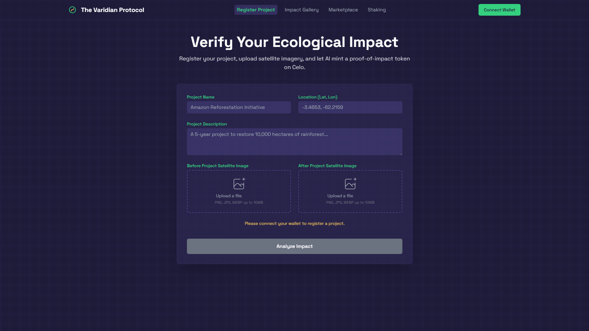
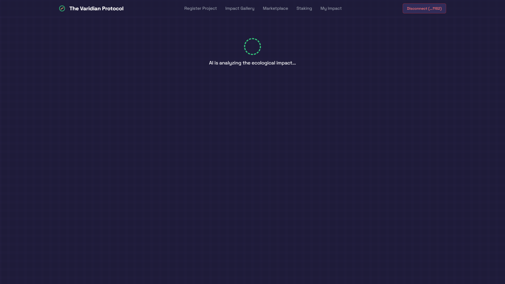
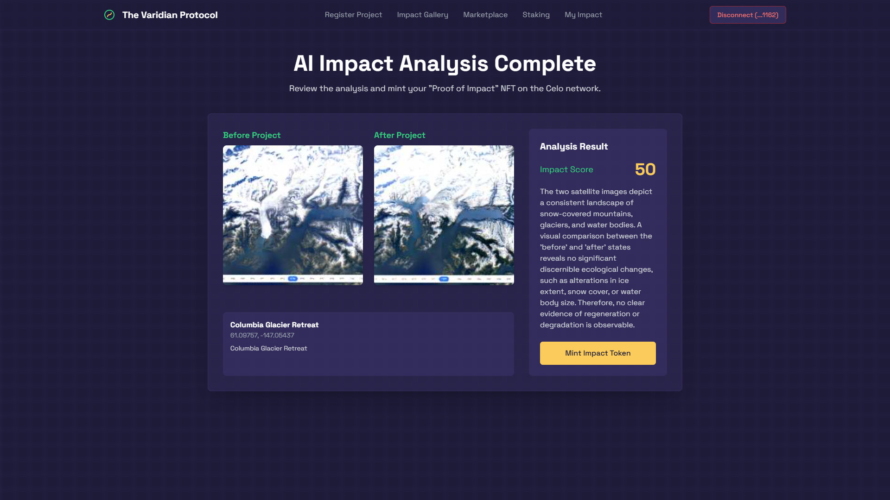
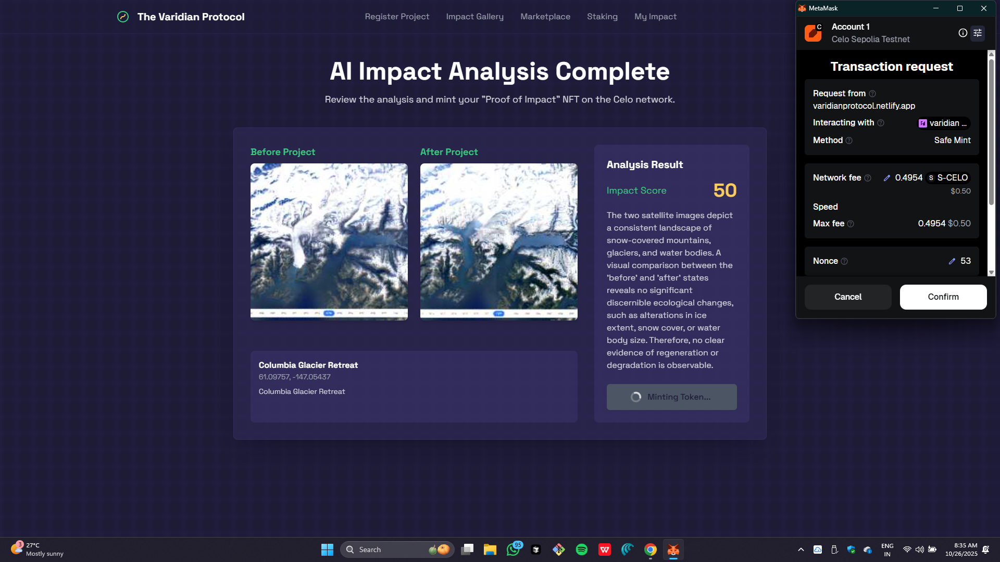
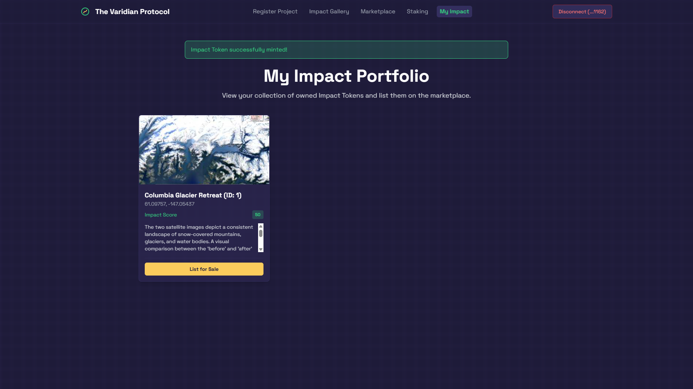
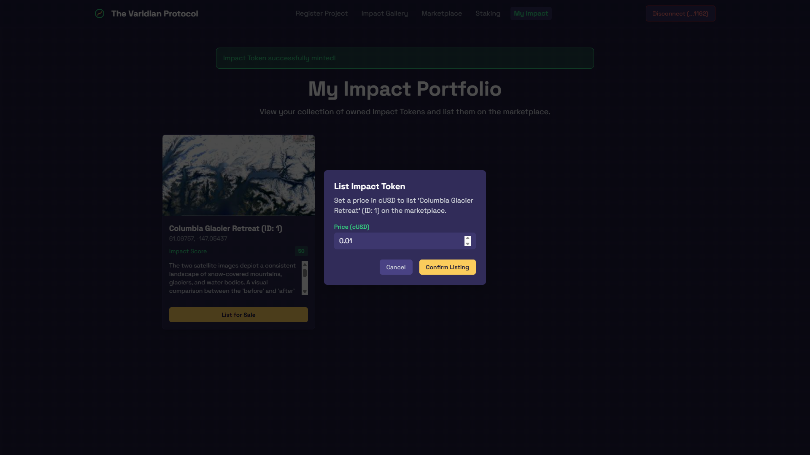
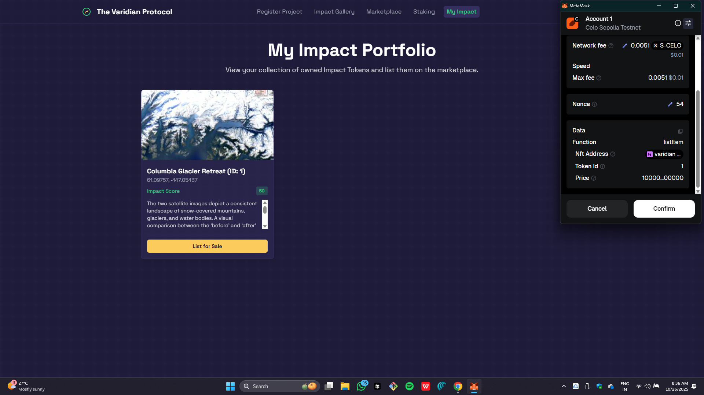
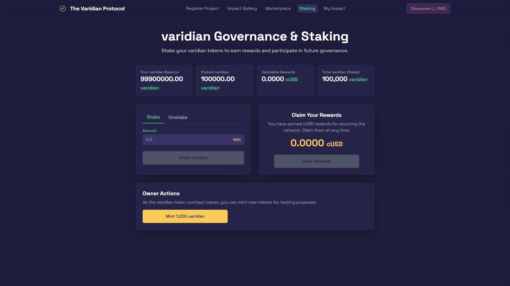
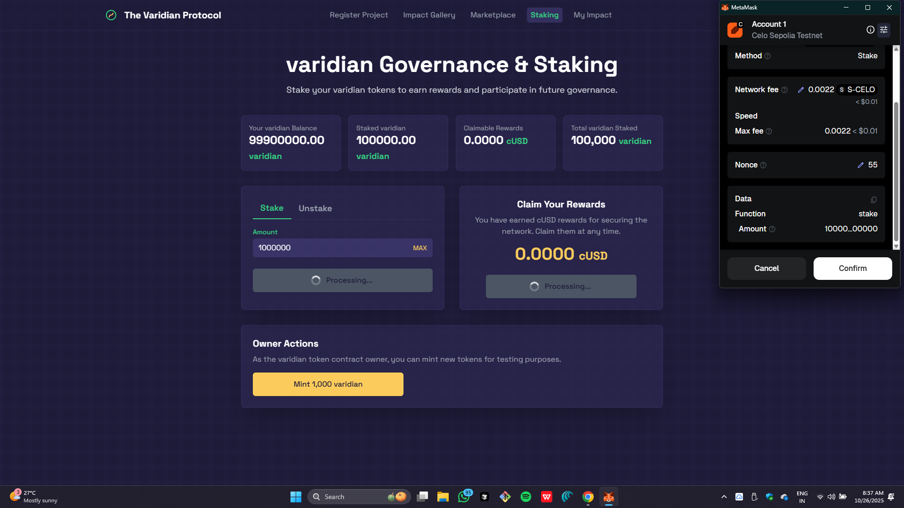
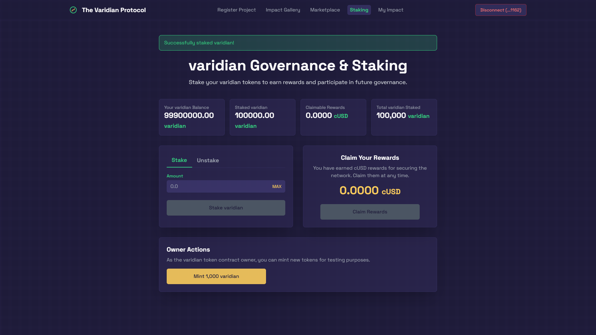

# The Varidian Protocol: Geospatial AI Asset-Indexer

**A decentralized platform on the Celo blockchain that uses Artificial Intelligence to verify, tokenize, and trade real-world ecological impact.**

## Deployed Application

- [Varidian Protocol Platform](https://varidianprotocol.netlify.app)
- [Project Resource Links (Doc)](https://docs.google.com/document/d/1LuYEuGLsqhMTdp9Ba1hmbr5spHdEZ-tK9pxYsDLjaYo/edit?usp=sharing)
- [Demo Video (YouTube)](https://youtu.be/Bf5u_bUkoYM)
- [Detailed Presentation (Google Slides)](https://docs.google.com/presentation/d/1sZJPCdeOKFFwIv_YenKzDnO3WIzv6Yf6GnBGd9Kxm-w/edit?usp=sharing)

## Smart Contracts on Celo Sepolia

The backbone of the Varidian Protocol is a suite of four interconnected smart contracts deployed on the Celo Sepolia testnet:

-   **ImpactToken (ERC-721):** The core NFT representing the proof of impact.
    -   Address: [`0xd3b07a0b6cf6fd0854a0d039257bf67ccaa2da4a`](https://celo-sepolia.blockscout.com/address/0xd3B07a0B6CF6fD0854a0D039257bf67ccAa2DA4A)
-   **VaridianToken (ERC-20):** The governance and utility token.
    -   Address: [`0x646e5c61ec28f03b800447db10a1d0bbfe655b30`](https://celo-sepolia.blockscout.com/address/0x646E5c61EC28F03B800447dB10a1d0bBfe655B30)
-   **Marketplace:** Handles the listing, buying, and selling logic.
    -   Address: [`0x4a321e3190831a1639a5130ed5fd66155747b0c3`](https://celo-sepolia.blockscout.com/address/0x4a321e3190831A1639a5130Ed5fD66155747b0C3)
-   **Staking:** Manages the staking of VARIDIAN tokens and distribution of cUSD rewards.
    -   Address: [`0x8fffda79a30bc1115d625484a36bb1d407522a65`](https://celo-sepolia.blockscout.com/address/0x8FFfDA79A30bc1115D625484a36BB1d407522A65)

---

   
  <b>The Varidian Protocol: Application Dashboard</b>

   
  <b>AI Analysing Submitted Satellite Imagery for Ecological Impact</b>

   
  <b>Impact Analysis Score via GEMINI-2.5-FLASH</b>

   
  <b>Minting Impact Token: Requesting Transaction Approval</b>

   
  <b>Token Minted Successfully</b>

   
  <b>List Impact Token for Sale on the Marketplace</b>

   
  <b>Approval Request for Listing Token</b>

   
  <b>Stake Celo to Earn Native VARIDIAN Tokens</b>

   
  <b>Transaction Approval for Staking</b>

   
  <b>Staking Successful</b>

## Table of Contents

- [Introduction](#introduction)
- [Core Concepts](#core-concepts)
- [Live Application Features](#live-application-features)
- [Technology Stack](#technology-stack)
- [How It Works: User Flow](#how-it-works-user-flow)
- [Smart Contracts on Celo Sepolia](#smart-contracts-on-celo-sepolia)
- [Future Scopes & Vision](#future-scopes--vision)
- [Contributing](#contributing)

## Introduction

Quantifying and funding ecological restoration is one of the most significant challenges of our time. Traditional systems often rely on trust-based reporting, which can be inefficient, opaque, and difficult to verify. This makes it challenging to channel capital effectively toward projects that deliver genuine, positive environmental change.

**The Varidian Protocol** (Geospatial AI Asset-Indexer) is a proof-of-concept that directly tackles this problem. It creates a transparent, data-driven, and liquid market for **"Proof of Impact."** By leveraging the power of multimodal AI and blockchain technology, we transform verified positive environmental outcomes—like reforestation or wetland restoration—into unique, ownable, and tradable digital assets (NFTs).

Our mission is to build a new financial primitive for the Regenerative Finance (ReFi) economy, where capital is seamlessly allocated to projects with the highest verifiable ecological return.

## Core Concepts

-   **Proof of Impact:** This is the central innovation. Instead of a simple claim, a "Proof of Impact" token is an AI-verified, on-chain record of positive ecological change, backed by empirical evidence from satellite imagery.

-   **Geospatial AI Analysis:** We use Google's powerful `gemini-2.5-flash` model to perform a multimodal analysis of "before" and "after" satellite images. The AI generates an objective **Impact Score** (from 0 to 100) and a detailed qualitative summary of the observed changes.

-   **Tokenization on Celo:** The AI's analysis, along with the project's metadata, is minted into an ERC-721 Impact Token (NFT) on the Celo blockchain. Celo was chosen for its mobile-first design, carbon-negative operations, and low transaction fees, making it an ideal platform for building an accessible and sustainable financial ecosystem.

-   **Regenerative Finance (ReFi):** The Varidian Protocol is a practical implementation of ReFi principles. It creates direct economic incentives for environmental stewardship by making ecological regeneration a valuable and liquid asset class.

## Live Application Features

The current application is a fully functional demonstration of the Varidian Protocol ecosystem:

1.  **Project Registration:** Users can submit the name, location, description, and "before" and "after" satellite imagery of their ecological projects.
2.  **AI-Powered Impact Analysis:** An automated, on-demand analysis of the submitted imagery, providing an unbiased assessment of the environmental impact.
3.  **NFT Minting:** A seamless user flow to mint the "Proof of Impact" token on the Celo Sepolia testnet, permanently storing the project's data and AI analysis on-chain via a data URI.
4.  **Impact Gallery:** A public showcase of all minted Impact Tokens, creating a transparent and inspiring ledger of collective positive action.
5.  **Decentralized Marketplace:** A full-featured marketplace where users can list, browse, and purchase Impact Tokens using **cUSD** (Celo Dollars).
6.  **VARIDIAN Governance & Staking:** A robust staking system where users can lock their native `VARIDIAN` tokens to earn `cUSD` rewards, providing liquidity and security to the ecosystem.
7.  **Wallet Integration:** Connects with browser wallets like MetaMask for secure and intuitive interaction with the Celo blockchain.

## Technology Stack

-   **Frontend:** React, TypeScript, Tailwind CSS
-   **AI / Machine Learning:** Google Gemini API (`gemini-2.5-flash`)
-   **Blockchain:** Celo (Sepolia Testnet)
-   **Web3 Libraries:** `viem` for modern, type-safe blockchain interactions.
-   **Smart Contracts:** Solidity, OpenZeppelin Contracts

## How It Works: User Flow

1.  **Connect:** A user connects their MetaMask wallet, which is automatically configured for the Celo Sepolia network.
2.  **Register:** A project owner fills out the registration form with project details and uploads the "before" and "after" satellite images.
3.  **Analyze:** The application sends the images to the Gemini API. The AI returns a JSON object containing the Impact Score and a textual analysis.
4.  **Mint:** The user reviews the AI's findings and signs a transaction to mint the Impact Token. The NFT's metadata is constructed and stored directly on the blockchain.
5.  **Manage & Trade:** The new token appears in the user's "My Impact" portfolio and the public "Impact Gallery." The owner can then list it for sale on the marketplace for a price set in cUSD.
6.  **Stake & Earn:** Any user can acquire `VARIDIAN` tokens (via the owner's minting function for this demo) and stake them in the staking contract to begin earning a passive yield in `cUSD`.

## Future Scopes & Vision

This proof-of-concept lays the foundation for a comprehensive and scalable ReFi ecosystem. Future development can focus on the following areas:

#### 1. True Decentralized Governance (DAO)
-   **On-Chain Voting:** Fully implement a DAO structure where `VARIDIAN` stakers can create and vote on governance proposals.
-   **Treasury Management:** Allow the community to vote on the allocation of marketplace fees stored in the Varidian Treasury to fund new projects, developer grants, or audits.

#### 2. Enhanced Data & AI Integration
-   **Automated Data Feeds:** Integrate with satellite imagery providers like Planet or Sentinel Hub for direct, real-time data feeds, reducing reliance on manual uploads.
-   **Multi-Source Verification:** Incorporate data from IoT sensors (e.g., for soil moisture, water quality) to create a more holistic and robust impact assessment.
-   **Advanced AI Models:** Utilize time-series analysis to track project progress over time, predict future impact, and automatically flag anomalies or potential "greenwashing."

#### 3. Deeper Financialization & UX
-   **Geospatial Visualization:** Implement an interactive world map to visualize project locations, allowing users to explore impact by region.
-   **Project Milestones:** Enable projects to raise funds in stages, with token value appreciating as predefined milestones are met and verified by the AI.
-   **Fractionalization:** Allow high-value Impact Tokens to be fractionalized, making them accessible to a broader range of supporters and investors.

#### 4. Cross-Chain Interoperability
-   Bridge Impact Tokens to other EVM-compatible chains (e.g., Ethereum, Polygon) to tap into larger liquidity pools and expand the user base.

## Contributing

We welcome contributions from the community! If you have ideas for new features, find a bug, or want to improve the codebase, please feel free to:

1.  Open an issue to discuss the proposed changes.
2.  Fork the repository and create a new branch for your feature.
3.  Submit a pull request with a clear description of your work.
